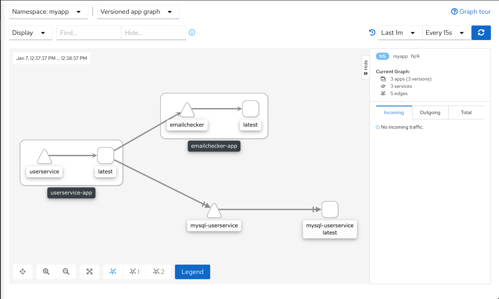

# Istio

Для демонстрации, был добавлен сервис проверки корректности адреса электронной почты emailchecker, 
к которому обращается userservice при создании пользователя.

## Подготовка

Создаем неймспейс
```kubectl create namespace myapp```

Устанавливаем зависимости
```helm install mysql-userservice -f user/helm/mysql/mysql.yaml bitnami/mysql --atomic```

Устанавливаем и запускаем Istio
```
istioctl install --set profile=demo -y
kubectl label namespace myapp istio-injection=enabled
``` 

Устанавливаем приложение
```
kubectl apply -f user/kube/configmap.yaml -n myapp
kubectl apply -f user/kube/secrets.yaml -n myapp
kubectl apply -f user/kube/initjob.yaml -n myapp
kubectl apply -f user/kube/deployment.yaml -n myapp
kubectl apply -f user/kube/service.yaml -n myapp

kubectl apply -f emailchecker/kube/deployment.yaml -n myapp
kubectl apply -f emailchecker/kube/service.yaml -n myapp
```

Важный момент: приложение надо устанавливать после установки истио, иначе в подах не появится
sidecar для контроля трафика.

Выполним несколько запросов на создание пользователя, чтобы появился трафик между сервисам
Адрес сервиса можно получить через ```minikube service userservice -n myapp```
```
curl --header "Content-Type: application/json" \
--request POST \
--data '{"username": "admin", "firstName": "Ivan", "lastName": "Petrov", "email": "test@mail.com"}' \
http://192.168.99.101:32598/api/v1/user
```

Запустим Kiali: 
```
istioctl dashboard kiali
```



Видим, что микросервис userservice обращается к сервисам emailchecker и mysql-userservice 
  