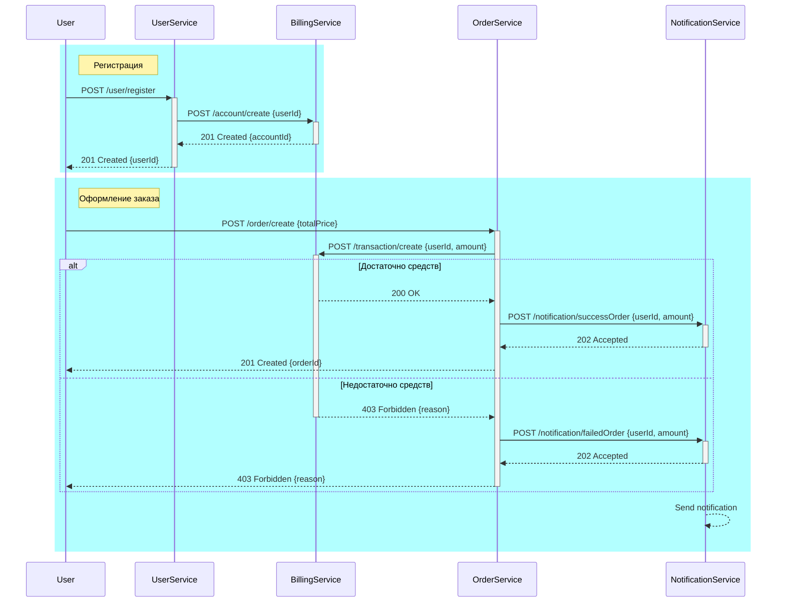
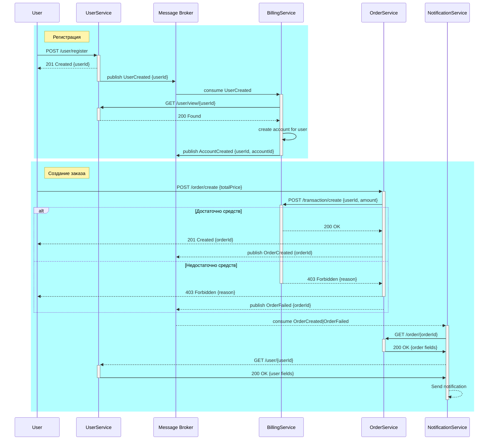

## Задание
Реализовать сервис заказа. Сервис биллинга. Сервис нотификаций. 

При создании пользователя, необходимо создавать аккаунт в сервисе биллинга. В сервисе биллинга должна быть возможность положить деньги на аккаунт и снять деньги.

Сервис нотификаций позволяет отправить сообщение на email. И позволяет получить список сообщений по методу API.

Пользователь может создать заказ. У заказа есть параметр - цена заказа. 
Заказ происходит в 2 этапа:
1) сначала снимаем деньги с пользователя с помощью сервиса биллинга 
2) отсылаем пользователю сообщение на почту с результатами оформления заказа. Если биллинг подтвердил платеж, должно отослаться письмо счастья. Если нет, то письмо горя. 

## Варианты реализации
### 1. Только HTTP взаимодействие

### 2. событийное взаимодействие с использование брокера сообщений для нотификаций (уведомлений)

### 3. Event Collaboration cтиль взаимодействия с использованием брокера сообщений